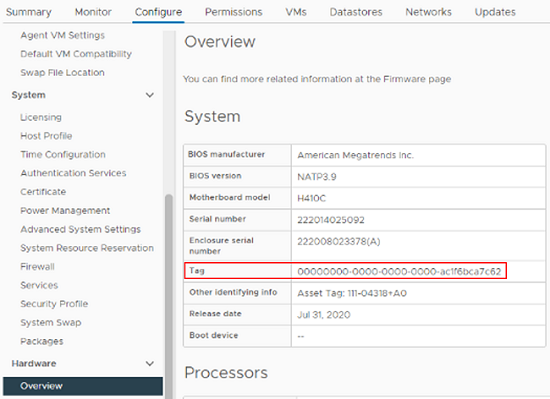

= 컴퓨팅 노드의 하드웨어 태그를 찾는 방법
:hardbreaks:
:allow-uri-read: 
:nofooter: 
:icons: font
:linkattrs: 
:imagesdir: ../media/

[role="lead"]
REST API UI를 사용하여 관리 노드 구성에 컴퓨팅 노드 자산을 추가하려면 하드웨어 태그가 필요합니다.

[role="tabbed-block"]
====
.VMware vSphere 8.0 및 7.0
--
VMware vSphere Web Client 8.0 및 7.0에서 컴퓨팅 노드의 하드웨어 태그를 찾습니다.

.단계
. vSphere Web Client 탐색기에서 호스트를 선택합니다.
. Configure * 탭을 선택합니다.
. 측면 표시줄에서 * 하드웨어 * > * 개요 * 를 선택합니다. 하드웨어 태그가 에 나열되어 있는지 확인합니다 `System` 표.
+

. 태그*의 값을 복사하여 저장합니다.
. xref:task_mnode_add_assets.adoc[컴퓨팅 및 컨트롤러 자산을 관리 노드에 추가합니다].

--
.VMware vSphere 6.7 및 6.5
--
VMware vSphere Web Client 6.7 및 6.5에서 컴퓨팅 노드의 하드웨어 태그를 찾습니다.

.단계
. vSphere Web Client 탐색기에서 호스트를 선택합니다.
. 모니터 * 탭을 선택하고 * 하드웨어 상태 * 를 선택합니다.
. 태그가 BIOS 제조업체 및 모델 번호와 함께 나열되어 있는지 확인합니다.
+
image:../media/hw_tag_67.PNG["시스템 테이블의 스크린 샷"]

. 태그*의 값을 복사하여 저장합니다.
. xref:task_mnode_add_assets.adoc[컴퓨팅 및 컨트롤러 자산을 관리 노드에 추가합니다].

--
====